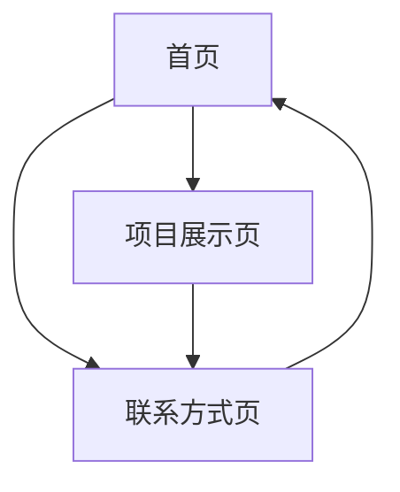

## 1. Product Overview

个人作品集网站，展示个人技能、项目经历和联系方式。为潜在雇主或客户提供专业形象展示平台，提升个人品牌价值。

## 2. Core Features

### 2.1 User Roles

无需用户注册，所有访客均可浏览网站内容。

### 2.2 Feature Module

个人作品集网站包含以下主要页面：

1. **首页**: 个人简介、技能展示、导航菜单
2. **项目展示页**: 项目列表、项目详情、技术栈展示
3. **联系方式页**: 联系表单、社交媒体链接

### 2.3 Page Details

| Page Name | Module Name | Feature description       |
| --------- | ----------- | ------------------------- |
| 首页        | Hero区域      | 展示个人头像、姓名、职位标题、简短介绍       |
| 首页        | 技能展示        | 展示技术技能列表，包含技能熟练度指示器       |
| 首页        | 关于我         | 详细介绍个人背景、经验和职业目标          |
| 项目展示页     | 项目列表        | 网格布局展示所有项目卡片，包含项目缩略图和标题   |
| 项目展示页     | 项目详情        | 点击项目卡片展开详情，展示项目描述、技术栈、截图  |
| 联系方式页     | 联系表单        | 访客填写姓名、邮箱、消息内容发送联系请求      |
| 联系方式页     | 社交媒体        | 展示GitHub、LinkedIn、邮箱等社交链接 |
| 全局        | 导航菜单        | 固定顶部导航，平滑滚动到对应区域          |
| 全局        | 页脚          | 版权信息和快速链接                 |

## 3. Core Process

访客浏览流程：

1. 访客进入首页，首先看到Hero区域的个人简介
2. 向下滚动查看技能展示和关于我信息
3. 点击导航菜单或按钮进入项目展示页
4. 浏览项目列表，点击感兴趣的项目查看详情
5. 进入联系方式页，通过表单或社交媒体链接建立联系

## 4. User Interface Design

### 4.1 Design Style

* 主色调：深蓝色 (#1e40af) 和白色

* 辅助色：浅灰色 (#f3f4f6) 和深灰色 (#374151)

* 按钮样式：圆角矩形，悬停效果

* 字体：系统字体栈，标题使用粗体，正文字体大小16px

* 布局风格：现代卡片式布局，大量留白，单页应用风格

* 图标风格：使用简洁的线条图标

### 4.2 Page Design Overview

| Page Name | Module Name | UI Elements               |
| --------- | ----------- | ------------------------- |
| 首页        | Hero区域      | 居中布局，大字体标题，渐变背景，个人头像圆形显示  |
| 首页        | 技能展示        | 水平排列的技能卡片，进度条显示熟练度，悬停动画效果 |
| 项目展示页     | 项目网格        | 响应式网格布局，卡片悬停放大效果，图片懒加载    |
| 联系方式页     | 联系表单        | 垂直表单布局，输入框聚焦高亮，提交按钮加载状态   |

### 4.3 Responsiveness

桌面优先设计，自适应移动端。在移动设备上采用单列布局，触摸友好的按钮和链接大小。
