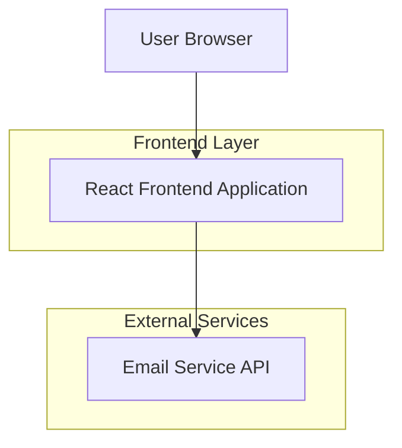
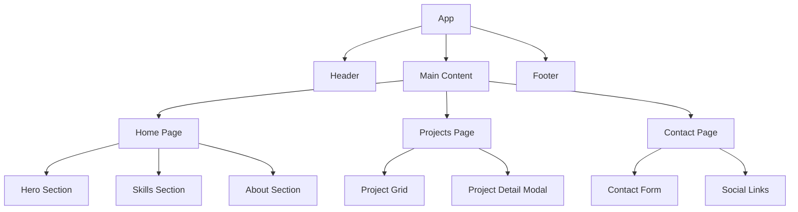

## 1. Architecture design



## 2. Technology Description
- Frontend: React@18 + tailwindcss@3 + vite
- Initialization Tool: vite-init
- Backend: None (纯前端应用)
- 部署: 静态网站托管 (Vercel/Netlify)

## 3. Route definitions
| Route | Purpose |
|-------|---------|
| / | 首页，展示个人简介和技能 |
| /projects | 项目展示页，展示所有项目 |
| /contact | 联系方式页，提供联系表单 |

## 4. API definitions
### 4.1 邮件发送服务 (可选)
如果使用邮件发送功能，可以通过以下方式实现：
- 使用 EmailJS 或类似服务
- 通过 Netlify Forms 或 Vercel Forms
- 使用第三方邮件服务 API

## 5. 组件架构


## 6. 项目结构
```
src/
├── components/          # 可复用组件
│   ├── Header.jsx
│   ├── Footer.jsx
│   ├── ProjectCard.jsx
│   └── ContactForm.jsx
├── pages/              # 页面组件
│   ├── Home.jsx
│   ├── Projects.jsx
│   └── Contact.jsx
├── data/               # 静态数据
│   ├── projects.js
│   └── skills.js
├── styles/             # 样式文件
│   └── globals.css
└── utils/              # 工具函数
    └── helpers.js
```

## 7. 性能优化
- 图片懒加载
- 代码分割 (React.lazy)
- 静态资源压缩
- CDN 加速
- 浏览器缓存策略

## 8. SEO 优化
- 语义化 HTML 标签
- Meta 标签优化
- Open Graph 标签
- 结构化数据 (JSON-LD)
- Sitemap.xml

## 9. 部署配置
- 使用 Vite 构建生产版本
- 配置自定义域名
- HTTPS 自动配置
- 404 页面重定向
- 性能监控集成